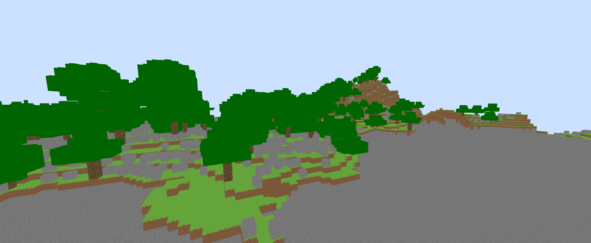

# villa (c++ rewrite)

A clean-room implementation of the Minecraft Beta 1.7.3 client.



Villa is in **extremely early alpha**. It lacks many features and is subject to crashing. However,
it has the potential to bring a new age to the beloved version of the game.

# Roadmap

- ⌛ Vulkan render backend
- ❌ Title screen
- ❌ Server networking
- ❌ Block rendering
- ❌ Entity rendering
- ❌ Physics
- ❌ Inventories & GUIs
- ❌ Sound
- ❌ Atmospherics, weather

**Long-term goals**

- Metal render backend
- Shaders, PBR, and other graphical enhancements
- Easy-access client-side scripting

# Setup

Download the [Vulkan SDK](https://vulkan.lunarg.com/)

Compile shaders:

```
glslc src/shader/shader.vert -o shader-vert.spv
glslc src/shader/shader.frag -o shader-frag.spv
```

Build & run:
```
mkdir build
cmake -B build
cmake --build build
./build/example/example(.exe)
```

# Credits

Font by [zedseven](https://github.com/zedseven/Pixellari)

Background by [Mockingjay1701](https://www.deviantart.com/mockingjay1701/art/Pixel-art-landscape-525082296)
